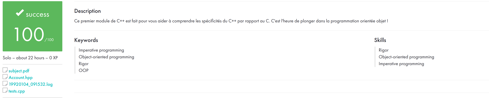

# ✨ 42 C++ Modules — From 00 to 04

Welcome to my curated collection of all C++ modules from **Module 00 to Module 06**, completed as part of the 42 curriculum.  
This repository showcases my progress through object-oriented programming, inheritance, polymorphism, and more.

score:



---

## 📦 Modules Overview

| Module | Topics                                     |
| ------ | ------------------------------------------ |
| **00** | Intro to C++, classes, member functions    |
| **01** | Memory allocation, references, pointers    |
| **02** | Operator overloading, canonical form       |
| **03** | Inheritance, multiple inheritance          |
| **04** | Abstract classes, interfaces, polymorphism |

---

## 📁 Structure

Each folder contains the exercises for a specific module.  
Code is organized, readable, and follows the 42 standards.

```
cpp_modules/
├── module00/
├── module01/
├── module02/
├── module03/
├── module04/
```

---

## 👤 Author

**Arnaud Derison**  
Student at 42 | Passionate about clean code & modern C++  
[GitHub](https://github.com/arnaudderison) • [Website](https://derison.dev)

---

## ⭐️ Support

If you find this repo helpful or inspiring, feel free to give it a ⭐️!  
Fork it, clone it, use it — make it your own.

---

## 📄 License

This project is open source and available under the [MIT License](LICENSE).
